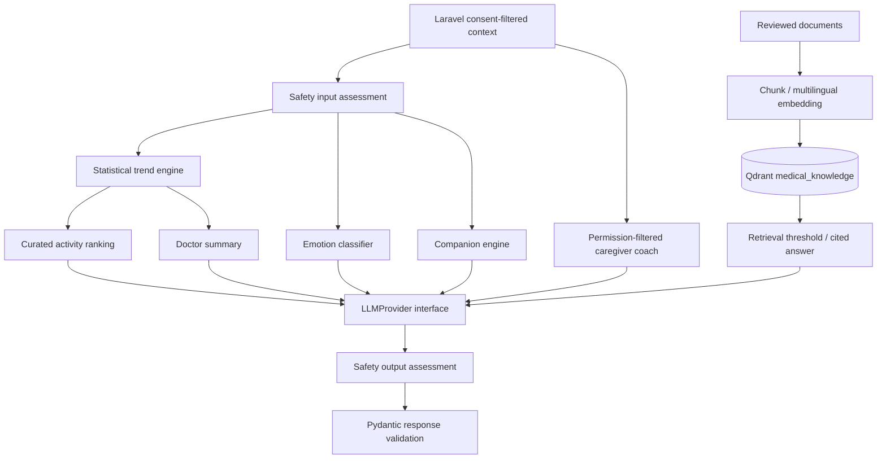

# AI engine

The trend computation is descriptive statistics, not falsely labeled trained ML. Semantic emotion extraction, contextual dialogue, constrained activity ranking and grounded synthesis use a real model in live mode. The full demo can run offline with MOCK_AI_MODE=true; every such output carries mode=mock. Live mode never silently falls back to mock.

Emotion: optional configurable multilingual transformer with explicit labels, or structured LLM classification; metadata records the selected method. Transformer labels require local validation for Indonesian oncology narratives. Estimates are not psychological diagnoses.

Trends use actual calendar offsets. Duplicate dates are rejected; insufficient data is reported; no interpolation. Mood/energy/sleep higher is better; anxiety/pain/fatigue/nausea/dizziness higher is worse. Appetite and sleep_quality higher is better. The prior recorded days form a baseline; recent 3-day means and slope are reported with coverage. Treatment associations compare observations within H-2…H+2 and use non-causal wording. Emotion aggregation uses only consented journal/check-in-derived signals. No claim of clinical accuracy.

Safety: conservative deterministic urgent cues plus semantic model classification in live mode; model response validation and a separate output review. Provider timeout/refusal/invalid schema fails closed with a sanitized error. Emergency resources are deployment configuration; no unvalidated number is embedded. Caregiver alerts are abstract and additionally gated in Laravel. This is not a clinically validated triage service.

RAG: admin-curated metadata (publisher, URL, version and reviewer) → PDF/TXT/MD extraction → bounded overlapping chunks → configurable sentence-transformer → Qdrant. Stable point IDs permit re-ingestion, and all old chunks for a source are replaced. Query filtering limits results to reviewed sources. Low retrieval scores abstain. Citation IDs are checked against retrieved chunks; no invented sources accepted. Knowledge is untrusted reference content and cannot override system instructions. No external web browsing or arbitrary URL fetch during ingestion. Medical sources are intentionally not invented or silently marked reviewed in seed data.
