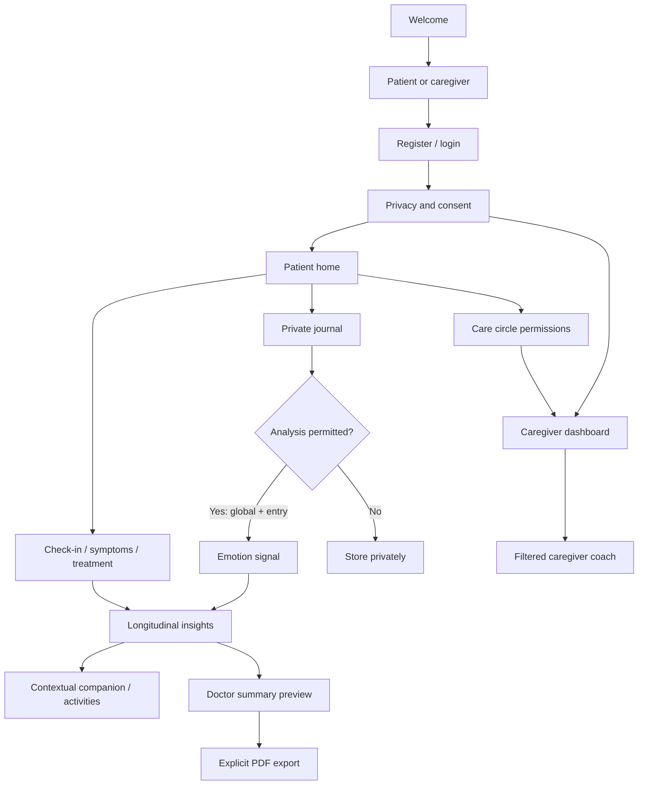

# Application flow

Home → Perjalanan → Hopely AI → Wawasan → Profil follows Stitch. Check-in and summary use dedicated routes. Journal, symptoms, activities and trusted knowledge are reachable from the home/profile/journey screens. All data screens include progress, empty and retry states. Form errors preserve input. No offline queue silently uploads private text later.
