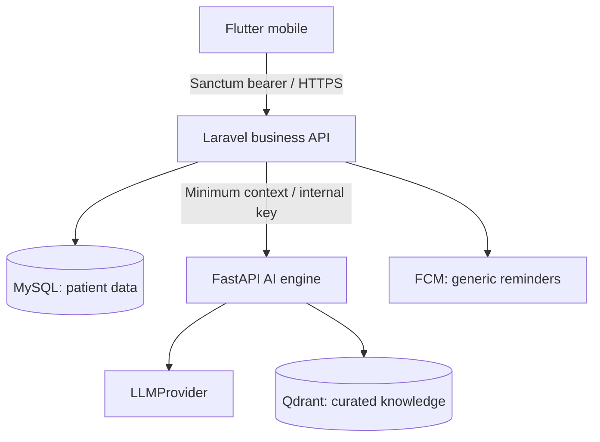

# Hopely Care — architecture decision record

## Authority
1. MASTER_REQUIREMENT.txt (the supplied text, copied unchanged).
2. Five supplied Stitch screenshots, preserved in docs/reference.
3. Revised conversation instructions.
4. Legacy proposal: background only. No technical decisions derive from it.

## Product boundary
Patient-controlled psycho-oncology support; no diagnosis, prognosis, prescribing, treatment selection, or automatic declaration that someone is safe. MVP roles: PATIENT, CAREGIVER, ADMIN. Doctors receive patient-created summaries, not accounts. Community and Meaningful Moments remain phase 2.

## Runtime boundaries

Flutter only calls Laravel. FastAPI and storage ports are not published in Compose. Laravel owns identity, resource ownership, consent, caregiver filtering and persistence. FastAPI is stateless for patient data. Knowledge ingestion accepts curated documents only; never user journals/chat. No patient embeddings are stored.

## Concrete decisions
- Laravel 13, PHP 8.4, Sanctum, MySQL 8.4 LTS. IDs use UUIDs for public resources.
- Flutter stable channel, Dart 3, Riverpod, GoRouter, Dio, secure storage, Material 3. Platform runner files are generated by a documented bootstrap command because Flutter SDK is absent in this workspace.
- Python 3.12, FastAPI/Pydantic. Provider interface with explicit mock provider and OpenAI structured outputs. No provider call without explicit live configuration.
- Trend engine: date-aware linear slope, rolling averages, personal baseline comparison, robust outlier flags, and event-aligned descriptive observations. At least 7 distinct recorded days before a direction is classified. Missing days stay missing. Scales never become diagnostic scores.
- Consent is explicit and off by default. Health processing gates health endpoints. AI chat context and journal analysis are separate permissions. Journal analysis also requires a per-entry toggle. Check-in note analysis requires a per-entry toggle too.
- Caregiver filtering happens before inference. Caregiver endpoints never return journal/chat text or check-in/symptom free text. Accepted link + current global sharing consent + per-link flag are all required.
- Revocation removes stored derived snapshots/recommendations/journal analysis. Subsequent reads recompute under current consent. In-flight provider requests cannot be recalled; results are rejected when consent state changes before persistence.
- Native notifications contain generic text. Treatment titles, diagnosis and AI/chat snippets never appear on lock screens.
- Reports use patient-reported numerical data and selected self-reported concerns, not clinical diagnoses. Journal/chat are excluded. PDF is generated on-device and shared only through an explicit patient action.
- Model confidence is an uncalibrated estimate, not a clinical probability. Mock metadata is present in API outputs and shown in Flutter.

## Source conflicts resolved
| Stitch content | Implementation decision |
|---|---|
| Fixed name, dates, hospital, age, diagnosis and physician | Render only stored patient-provided information; seed is clearly synthetic. |
| Medication-oriented suggested questions | Use neutral discussion prompts about recorded symptoms; no drug/dose suggestion. |
| Sleep duration claim | Track sleep quality 1–5; never infer hours. |
| Future plotted values | Plot recorded dates only; upcoming treatment is a separate event marker. |
| “Kamu aman di sini” | Supportive wording without an unverified safety guarantee. |
| Voice icons / direct hospital sending | Outside MVP; no inert buttons presented as working features. |
| Breathing technique with holds | Curated gentle grounding/reflection; no invented medical efficacy. |

## Data lifetime
Tokens have expiry, can be revoked and are held in OS secure storage. Sensitive free text is encrypted with Laravel encrypted casts. Encryption keys require deployment backup and rotation. Account deletion cascades patient records, caregiver links and device tokens, and revokes Sanctum tokens. Audit entries contain event names/resource IDs only and no PHI; account-linked entries are deleted. External provider retention must be assessed before real-patient deployment; requests use store=false. Backups need an operator-managed expiry policy.

## Operational boundary
Compose is a local-development runtime, not production hosting. Production requires HTTPS ingress, secret manager, private networking, managed backups, deployment monitoring without PHI, provider governance and clinical/privacy review. Safety classification is fallible and is not continuous monitoring or emergency dispatch.
