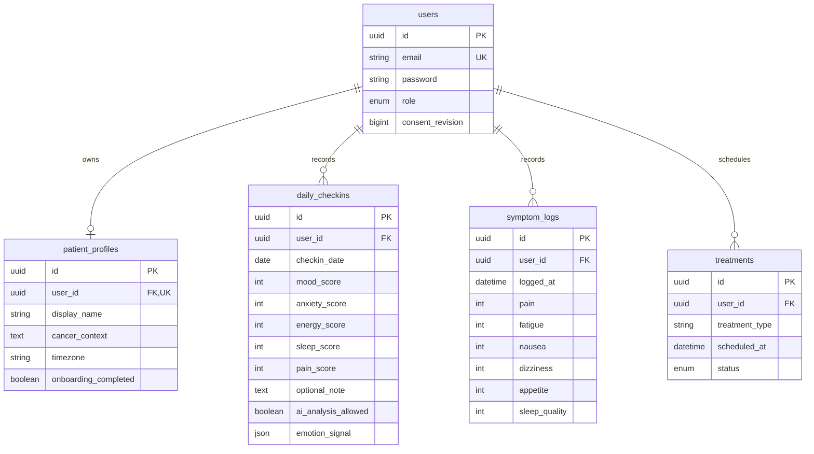
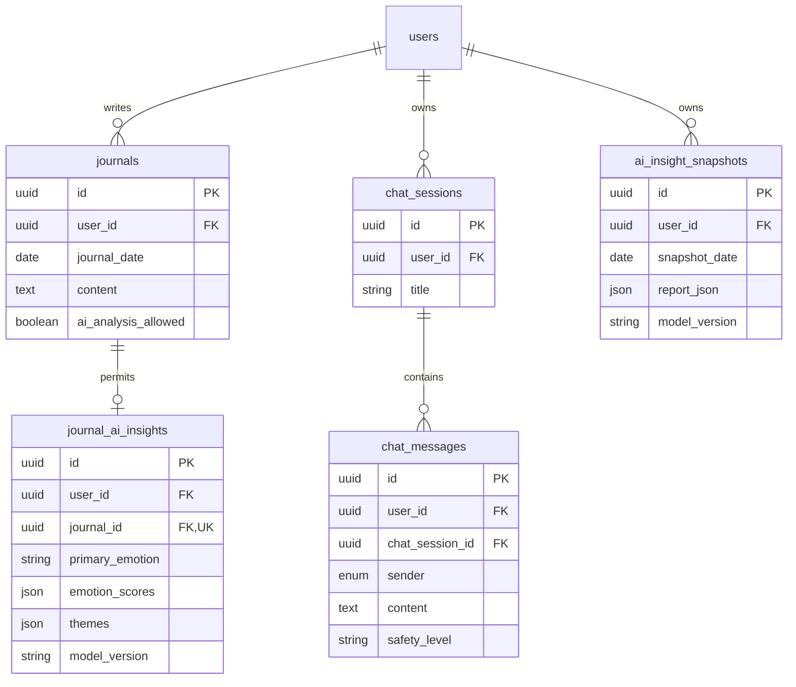
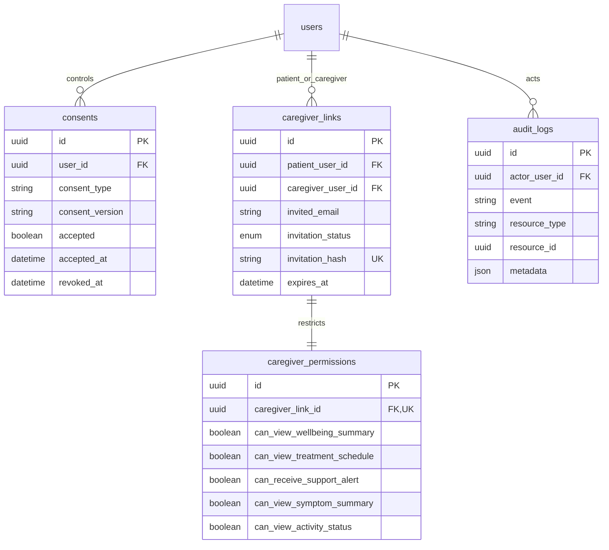
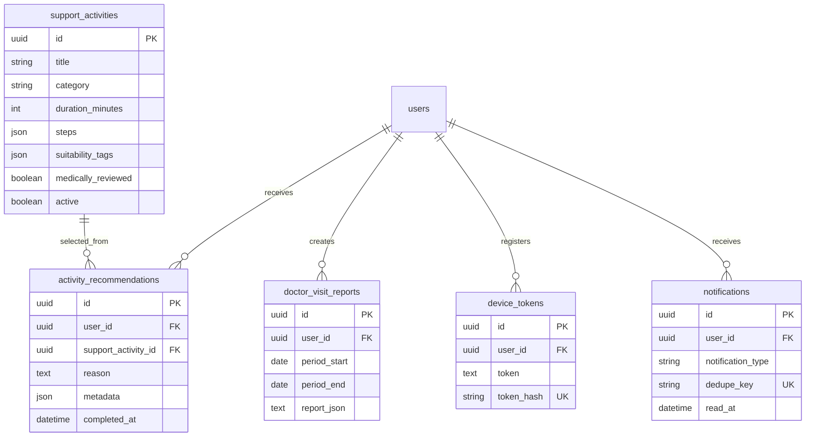

# Database ERD
Public resource IDs use UUID primary keys. Every ownership/link foreign key cascades on account deletion. Timestamps and indexes are defined exactly in the migration. There is no redundant numeric ID + UUID pair. Diagrams are split by domain for readability.

## Identity and patient records

Unique daily check-in key: `(user_id, checkin_date)`. Date semantics use patient timezone; timestamp instants are stored UTC. Symptom appetite/sleep_quality and check-in mood/energy/sleep are positive-direction scales; pain/anxiety/fatigue/nausea/dizziness are negative-direction scales.

## Private writing and AI context

`report_json` stores the typed trend contract rather than duplicating evolving AI output fields in separate columns. Journal/chat free text uses encrypted casts. Snapshot and journal insight rows are deleted when consent is withdrawn.

## Caregiver authorization

Consents are unique by `(user_id, consent_type)`; latest state lives here, acceptance/revocation events live in metadata-only audit records. Invitation token hashes are nullable after acceptance/revocation, unique, one-use and bound to intended email. No journal/chat sharing flag exists in the MVP.

## Activities, reports and device delivery

Sanctum additionally owns `personal_access_tokens` with UUID polymorphic tokenable keys and expiry. Qdrant is a separate non-patient knowledge store; its chunk payload schema is documented in `AI_ENGINE.md`.
